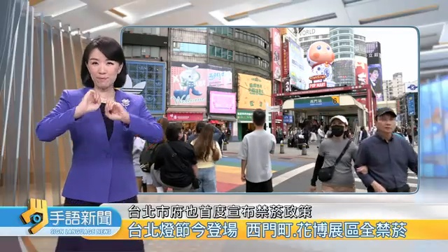
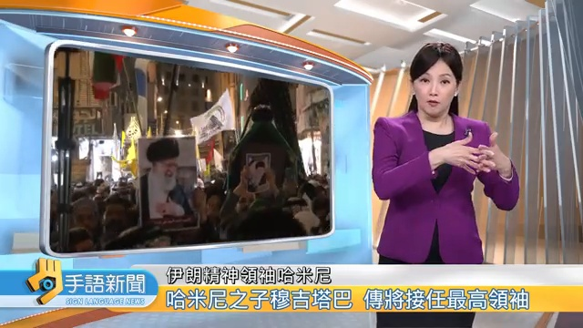
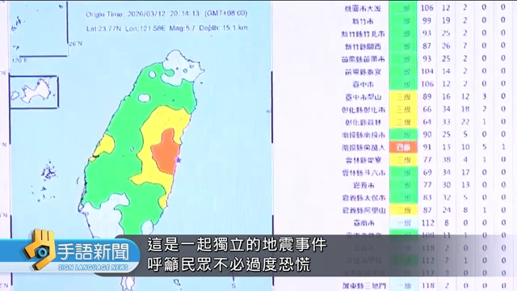

# News Layout Classifier

> Screen layout classifier for **PTS Sign Language News** (公視手語新聞).
> Automatically categorizes live stream captures into three layout types.

[YouTube Channel](https://www.youtube.com/@slnewsptsTaiwan)

---

## Project Goal

PTS Sign Language News live stream captures fall into three common layouts:

| Label    | Description                                                     | Example                                                   |
|----------|----------------------------------------------------------------|-----------------------------------------------------------|
| `left`  | Anchor on the **left**, AI assistant (sign language interpreter) on the **right** |  |
| `right` | Anchor on the **right**, AI assistant on the **left**          |  |
| `other` | News main frame — no anchor in the standard layout (weather graphics, motion backgrounds, full-screen anchors) |  |

**Use cases:** literature organization, video analysis, preprocessing for downstream automation tasks.

**Accuracy: 99.78%** (5x80/20 cross-validation, left: 100%, right: 100%, other: 99.6%)

---

## Installation

```bash
pip install git+https://github.com/miles0428/news-layout-classifier.git
```

Or from a local clone:

```bash
git clone https://github.com/miles0428/news-layout-classifier.git
cd news-layout-classifier
pip install .
```

---

## Quick Start

```python
from news_layout import NewsLayoutClassifier

clf = NewsLayoutClassifier()       # loads built-in templates automatically
label = clf.classify("image.jpg")  # "left" / "right" / "other"
```

---

## CLI

```bash
# Classify a directory (outputs left/, right/, other/ subfolders)
news-layout batch INPUT_DIR OUTPUT_DIR

# Classify a single image
news-layout single image.jpg

# Test on pre-labeled folders
python test.py ROOT_DIR
```

---

## Algorithm

**Pixel-wise Match Ratio**

1. For each pixel: compute `|test - template|`
2. If `|diff| < pixel_tol` → count as "matching"
3. Score = fraction of matching pixels (higher = better match)
4. If both scores < `min_match` → `other`; otherwise the higher score wins

**Default parameters:**
- `pixel_tol = 0.05` — per-pixel tolerance (in [0,1] image space)
- `min_match = 0.30` — score below this is classified as `other`
- `active_cols` — only edge + central UI frame columns are evaluated (31 columns total)

---

## Project Structure

```
news-layout-classifier/
├── pyproject.toml
├── src/news_layout/
│   ├── __init__.py
│   ├── __main__.py                    # CLI entry point
│   └── templates/
│       └── news_layout_templates.npz   # pre-trained templates (189 left + 215 right images)
├── examples/
│   ├── 000008_245.jpg    # left example
│   ├── 000003_90.jpg     # right example
│   └── 000064_802.jpg    # other example
└── README.md
```

---

## Data & Training

Pre-trained templates were built from [PTS Sign Language News](https://www.youtube.com/@slnewsptsTaiwan) YouTube live stream captures, manually categorized into `left` / `right` folders.

To re-train with your own data:

```bash
news-layout train left_dir right_dir --out my_templates.npz
```

---

## Disclaimer

This project is released for **learning and research purposes only**.

- Templates and model were trained solely on publicly available YouTube screenshots
- Accuracy figures are specific to this dataset and do not guarantee generalization to other data
- This tool is not affiliated with, endorsed by, or representative of PTS (Public Television Service) or any associated institutions
- When citing in academic papers, teaching materials, or any non-commercial use, please reference this repository:
  > https://github.com/miles0428/news-layout-classifier
